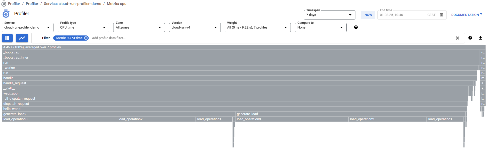

# Cloud Profiler for Cloud Run

How-to guide: Using Cloud Profiler in Cloud Run, using a minimum Python Flask webapp.

The official Google Cloud docs only list GCE, GKE, App Engine, and outside Google Cloud as available app deployment environments for using Cloud Profiler.
This repository wants to explore if and how Cloud Profiler can be used in Cloud Run.

For this purpose, a Python Flask webapp will be used.

## Maintainer

- Marcos Manuel Ortega - Director @ Indavelopers
- Consultant, architect & trainer
- Google Developer Expert - Google Cloud, modern infrastructure
- Google Cloud Authorized Trainer
- <info@indavelopers.com>
- LinkedIn: [linkedin.com/in/marcosmanuelortega](https://www.linkedin.com/in/marcosmanuelortega/)
- Made with ❤️ from Almería, Spain

## Documentation

- <https://cloud.google.com/profiler/docs/profiling-python>
- <https://cloud.google.com/profiler/docs/profiling-external>

## Before you begin

- Have a working Google Cloud project, linked to a working billing account
- Use Cloud Shell or a initialized and authenticated local Cloud SDK installation
  - Set the GCP project config with `PROJECT_ID`: `gcloud config set PROJECT_ID`
- Enable the required Google Cloud APIs:
  - Cloud Run Admin API
  - Artifact Registry API
  - Cloud Profiler Admin API
- Required roles:
  - Cloud Run Admin
  - Artifact Registry Administrator
  - Cloud Profiler User

**Important note on dependencies:** The Cloud Profiler Python package supports Python 3.7 to 3.10 ([google-cloud-profiler on PyPI](https://pypi.org/project/google-cloud-profiler/)), so the Dockerfile uses the Python 3.10 base image ([Docker Hub](https://hub.docker.com/_/python)).

Also, for installing the Cloud Profiler Python module you need a C/C++ compiler and development tools installed ([docs](https://cloud.google.com/profiler/docs/profiling-python#using-profiler)), so the `3.10` tag is used instead of the `3.10-slim` tag.

## Usage

TL;DR:

1. Clone the repo: `git clone https://github.com/Indavelopers/cloud-profiler-for-cloud-run`, `cd cloud-profiler-for-cloud-run/webapp`
2. Create & activate a Python virtual env: `python3 -m venv venv`, `source venv/bin/activate`
3. Install dependencies: `pip install -r requirements.txt`
4. Create a Google Artifact Registry repo named `webapp` in location e.g. `europe-west4`: `gcloud artifacts repositories create webapp --repository-format=docker --location=europe-west4`
5. Authenticate Docker with Cloud SDK: `gcloud auth configure-docker europe-west4`
6. Build the container image locally: `docker build -t europe-west4-docker.pkg.dev/cloud-profiler-for-cloud-run/webapp/webapp:latest .`
7. Push the container image to Google Artifact Registry: `docker push europe-west4-docker.pkg.dev/cloud-profiler-for-cloud-run/webapp/webapp:latest`
8. Create a Cloud Run service named `webapp` and deploy the app: `gcloud run deploy webapp --region europe-west4 --image europe-west4-docker.pkg.dev/cloud-profiler-for-cloud-run/webapp/webapp:latest --allow-unauthenticated`
9. Generate some traffic with Locust:
   1. Install Locust: `pip install locust`
   2. Substitute Cloud Run service URL in `locustfile.py`:
   3. Start Locust: `locust -f ../locustfile.py`
   4. Run Locust for 2-5 minutes.
10. Check Cloud Profiler in Google Cloud Console

You should see something similar to this (`cloud-profiler-demo.png`):

## License

MIT License (see `LICENSE` file).

## Known issues

Tested at the time of the last commit:

- None

If you find any issues, please open a GitHub issue, open a PR with a fix, or contact the maintainer.

## Contributions, help and discussion

Please, open an issue, submit a pull request, or generally contact the author by any means.

## TO-DOs

- Check support for Cloud Run functions
- Check support for Cloud Run jobs
